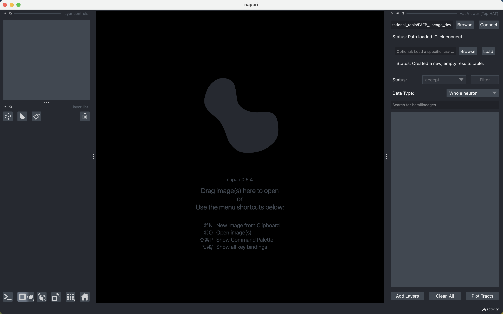
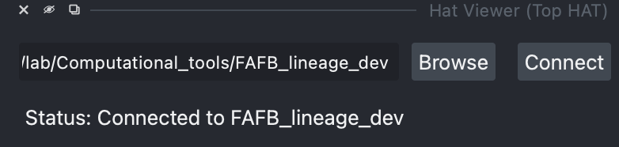
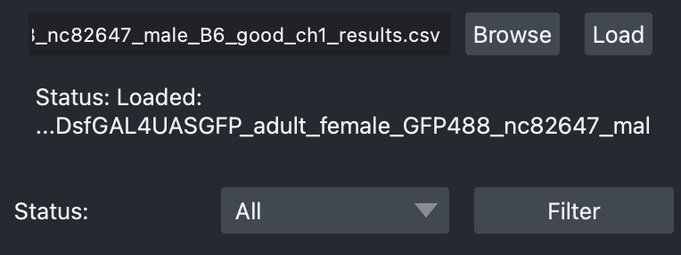
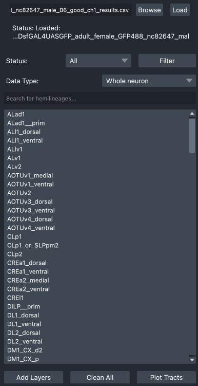
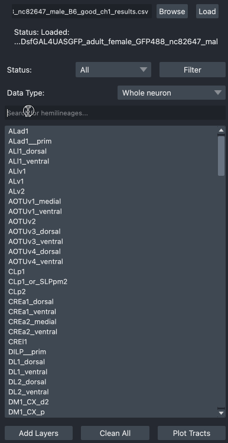
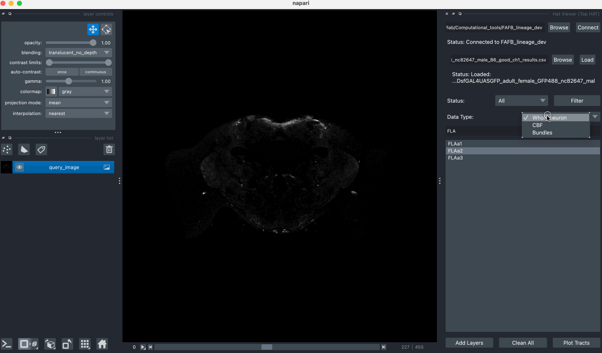
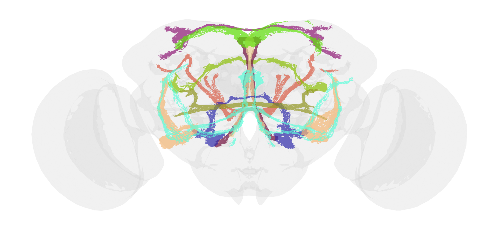

# HAT Viewer Usage Guide

This guide explains how to use the **HAT Viewer** module within the Hi-HAT plugin to explore and visualize hemilineage data. You can also use this tool to co-visualize hemilineage data with a registered light microscopy image.

## Overview

The HAT Viewer provides an interface to browse, filter, and display hemilineage tracts and individual neurons from the connected dataset. It works in conjunction with the **Results Loader** to allow importing hemilineages from a [Top Match](top_match.md) results file and filtering them by review status.

---

## 1. Connecting to Data

Before using the viewer, you must connect to a dataset using the **Connect** button. Once connected, the HAT Viewer will be enabled. You will need to specify the path to the database the first time; the path will be saved for future use.

*Connected status*

## 2. Loading a Light Microscopy Image (Optional)

A key feature of the HAT Viewer is the ability to co-visualize the template hemilineage data with your own registered brain images. Note that the light microscopy image should be registered to the [JRC2018U template](https://www.janelia.org/open-science/jrc-2018-brain-templates) with a voxel size of 0.38 microns. You can drag and drop a single-channel, `.nrrd` or `.tif`/`.tiff` image into the user interface to load it.

1.  If you have a results file generated by [Top Match](top_match.md) in the same folder as the image, the HAT viewer will automatically load it. Alternatively, you can manually load a `.csv` file that has a "Hemilineage" column and a "status" column.

2.  Once a results file is loaded, the **Filter by Status** dropdown and **Filter** button in the HAT Viewer will become active.

*load results to enable status filter*

## 3. Filtering by Status (Optional)

This feature is enabled by successfully loading a `results.csv` file. It allows you to narrow down the list of hemilineages based on the review status assigned in the [Top Match](top_match.md) widget.

1.  **Select a Status**: Choose a status from the **Filter by Status** dropdown menu (e.g., `accept`, `reject`, `unsure`, `not_reviewed`, `All`).
2.  **Apply Filter**: Click the **Filter** button. The list will update to show only the hemilineages that match the selected status in the current results file. Select `All` to show all hemilineages.

*Filtering results*

## 4. Browsing and Displaying Hemilineages

The main list displays all available hemilineages.

-   **Search**: You can type in the search box at the top to dynamically filter the list by name. This is useful for quickly finding a specific hemilineage.
-   **Selection**: Click on any hemilineage in the list to select it. You can select multiple hemilineages by holding `Command` (on macOS) or `Ctrl` (on Windows/Linux) while clicking.

Once you have selected one or more hemilineages, you can load their corresponding data into the napari viewer. You can use the **Data Type** dropdown to select one of the following to load:

-   **Whole neuron**: The entire volume, including cell bodies, tracts, dendrites, and axons of a hemilineage. Each neuron group will be added as a layer named `[HemilineageName] Whole neuron`.
-   **CBF**: The longest cell body fibers. Each CBF will be added as a layer named `[HemilineageName] CBF`.
-   **Bundle**: The hemilineage-associated tracts. Each bundle will be added as a layer named `[HemilineageName] Bundles`.

Then, click **Add Layers** to load the selected hemilineage data type into the current viewer. You can hide or remove layers using the tools on the left side. You can also click **Clean All** to remove all added layers.

> **Notes**:
> 1. You can use the 2D/3D toggle on the lower left to switch view.
> 2. Layers are assigned a random color for visibility. You can change the color by clicking on `colormap`
> 3. If you added a layer and couldn't see it, check if it's covered by the `query image` layer. It's a good practice to keep `query image` on the bottom.

## 5. Experimental Function: Plotting Tract Map

You can click **Plot Tracts** to save the currently displaying tracts with their corresponding colors into a 2D image with the JRC2018U brain mesh.

