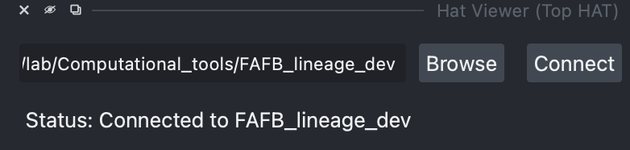

# Top Match Widget Usage Guide

This guide explains how to use the **Top Match** module of Top HAT to interactively match hemilineages from a light microscopy image.

## Overview

**Top Match** provides a graphical user interface powered by [NBLAST](https://navis-org.github.io/navis/generated/gallery/5_nblast/tutorial_nblast_00_intro/) to match hemilineages. Cell body location and tract morphology are the key features used to identify a hemilineage in the drosophila brain. A user can load a registered query image into Top Match, and candidate hemilineages will be ranked based on a combination of both features, ready for real-time proofreading.

Below is a general summary of workflow and corresponding widgets.

There are two major sections:

1.  **Initialization** (steps [1](#1-connecting-to-data), [2](#2-loading-results), [3](#3-threshold), less than 1 min): These steps are required every time you start napari. They include connecting to the FAFB hemilineage map database, automatically loading saved progress, and thresholding the image.
2.  **Proofreading Cycle** (steps [4](#4-cet-cluster-centriod), [5](#5-target-hemilineages-editing-box), [6](#6-mathcing), [7](#7-results-table), [8](#8-displaying-results), [9](#9-save-results), 5-10 min): These widgets are activated once Top Match is initiated properly. In each proofreading cycle, you will click on a cell body cluster, and proximal hemilineages will be added for voxel/NBLAST comparison. A results table ([7](#7-results-table)) will display hemilineages ranked by matching score, and you can load selected ones to co-visualize with the query image. After proofreading, update the hemilineages' reviewing status and save the progress. Then, you can click on a different cell body cluster to start a new cycle.

>Note: For the current version, it's generally good practice to initiate Top Match first and then load the image.

Detailed instructions for each step is shown below:

---

### 1. Connecting to Data

Before using other widgets, you must connect to the connectome hemilineage tract database using the **Connect** button. You will need to specify the path to the database the first time; the path will be saved for future use.

*Connected status*

---

### 2. Loading results

By default, Top Match will create an empty results table for each query image and save it to the specified save path along with the image. The results table will be named `[image_name]_results.csv`. It contains the following columns:
- **Hemilineage**: The hemilineage name in Ito-Lee style.
- *query_centroid*: The centroid coordinates of cell body clusters in the format (z, y, x microns). This is for saving progress.
- *time_stamp*: The last time the matching score was updated.
- *voxel_score*: For each hemilineage tract, the voxel_score is calculated as the fraction of overlapping voxels: $\frac{Binary\ query\ image \cap target\ tract}{target\ tract}$, with a range of (0, 1).
- *NBLAST_score*: See [NBLAST](https://navis-org.github.io/navis/generated/gallery/5_nblast/tutorial_nblast_00_intro/) for details. The score indicates proximity and morphological similarity, ranging from (-1, 1). A score above 0.6 is typically considered "similar".
- **status**: The proofreading status, which should be one of (`not_reviewed`, `accept`, `unsure`, `reject`).
- *threshold*: Records the threshold used for the binarized image when the matching scores were calculated.

If a results table has been created before, it will be automatically loaded, allowing you to resume your proofreading progress. You can also manually load a results table saved in a different path.

The results table can also be loaded into the [HAT viewer](hat_viewer.md) to filter hemilineages for display.

---

### 3. Threshold

A binary image is required for both voxel matching and NBLAST matching. You can click the **Threshold** button, and a threshold will be calculated using [Otsu's method](https://en.wikipedia.org/wiki/Otsu%27s_method). A `binarized_image` layer will be added to the viewer, shown in magenta. You can update the threshold by typing in a value (0-255) or using the slide bar, then clicking the **Threshold** button again. The key is to include tracts while excluding background noise.

>Note: You can update the threshold at any time. If an image has non-uniform brightness, you can set different thresholds for the different tracts you want to match.

---

### 4. Get cluster centroid

*This widget will be active if steps 1-3 are completed.*

This widget can search for potential target hemilineages based on the proximity of cell bodies. Top Match calculates a searching radius for each hemilineage based on its cell body distribution. The radius is calculated as 3x the Root Sum of Squares of Error of the cell bodies and their mirrored counterparts on the contralateral side.

-   **Usage**: Select the `Selected Points` layer and click on the cell bodies in a cluster. You can click on a few of them on different Z-slices. Then, click the **Get Cluster Centroid** button. A dialog will pop up to ask which points should be used for calculating the query centroid; by default, all of them are used. A red dot will be appended to the `LM_centroid` layer to indicate the calculated query centroid, and a list of proximal hemilineages will be added to the [Target hemilineages editing box](#5-target-hemilineages-editing-box).

### 5. Target hemilineages editing box

*This widget will be active if steps 1-3 are completed.*

Proximal hemilineages from [step 4](#4-get-cluster-centroid) will be added into this box, ranked by proximity. You can edit the hemilineage list to add or remove hemilineages from the matching process.

---

### 6. Matching

*This widget will be active if steps 1-3 are completed.*

There are two methods of matching, as described in [step 2](#2-loading-results). Note that voxel matching is likely to have false-negative results if the tract is thin or slightly variable across brains. NBLAST compensates for this but is sensitive to noise if the image background is high. The NBLAST matching might take 1-2 minutes if you are running Top Match on a decent computer. Check the terminal or command-line tool for progress.

-   **Usage**: Check the type of matching you want to run (by default, both are selected), then click **Matching**.

---

### 7. Results table

*This widget will be active if steps 1-3 are completed.*

The matching results will be displayed in the results table, ranked by NBLAST score by default. You can re-rank the results, select the types of hemilineage data you want to display, and update the reviewing status in this table.

Use the check box before the table to switch between displaying all mathcing results or the most recent matching results. By default, the must recent matching results are displayed.

### 8. Displaying results

-   **Usage**: With "tract" or "whole neuron" selected, click **Update Display**. The corresponding type of hemilineage data will be added to the current viewer as layers named `[hemilineage_name]_[type]`.

> **Notes**:
> 1. You can use the 2D/3D toggle on the lower left to switch view.
> 2. Layers are assigned a random color for visibility. You can change the color by clicking on `colormap`
> 3. If you added a layer and couldn't see it, check if it's covered by the `query image` layer. It's a good practice to keep `query image` on the bottom.

### 9. Save results

-   **Usage**: After updating the review status, click **Save Results**. This will complete a proofreading cycle. You can go back to [step 4](#4-get-cluster-centroid) if there are cell body clusters or tracts that are not yet matched.
